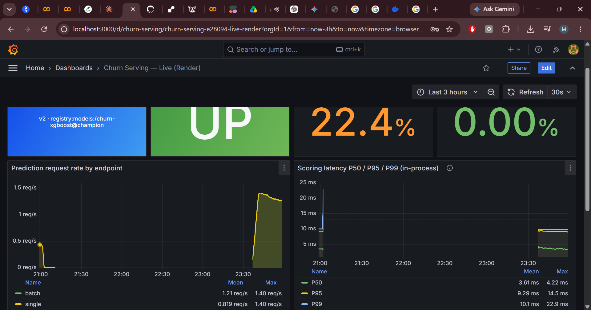
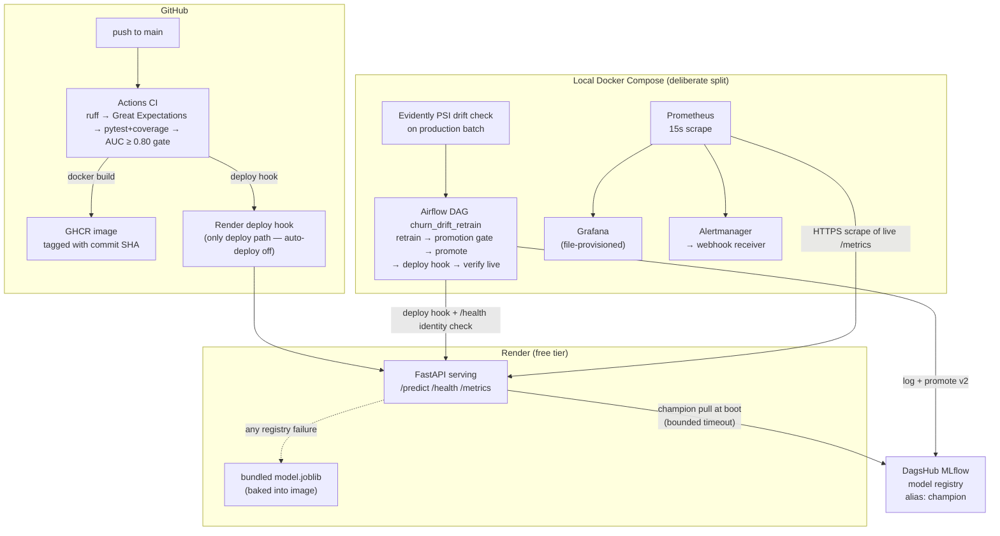

# ML Pipeline with CI/CD & Drift Monitoring — Customer Churn

An end-to-end MLOps project built around one rule: **no claim without a committed
evidence file.** An XGBoost churn model (Telco dataset) is trained with Optuna,
registered in a DagsHub-hosted MLflow registry, served live on Render behind
FastAPI, deployed exclusively through a gated GitHub Actions pipeline, watched by
Prometheus/Grafana scraping the live endpoint, and automatically retrained,
promotion-gated, and redeployed when Evidently detects population drift. Every
number in this README traces to a raw results file in [`eval/results/`](eval/results/)
— the full metric-to-evidence map is in [RESULTS.md](RESULTS.md).


*Local Grafana scraping the live Render endpoint: verifiable model identity (registry champion v2), request rate, in-process latency quantiles, live error rates. The [fired-alert view](monitoring/dashboard_error_spike.png) shows the demonstrated alert (below).*

**Live demo:** <https://ml-pipeline-with-ci-cd-drift-monitoring.onrender.com/health>
(free tier — if idle it cold-starts in ~30 s, measured at 32.5 s; warm requests
return in well under a second).

## Architecture



**The split is the design, not a compromise to apologize for:** only the slim
serving container (~825 MB image, 512 MB RAM budget) runs on Render;
orchestration and monitoring run on a separate host (local Docker Compose),
scraping the live endpoint over the public internet. That mirrors real
production separation — monitoring must not live or die with the service it
watches — and it makes the free tier a feature: every reliability number below
was measured against genuinely constrained hardware (0.1 CPU), not a laptop.

Two identity guarantees stitch the topology together:

- **Deploys happen only through CI.** Render's auto-deploy is off; the image is
  pushed to GHCR tagged with the commit SHA, and the deploy hook fires only
  after lint, data validation, tests, and the AUC quality gate pass.
- **The live model is verifiable, never assumed.** `/health` and the
  `churn_model_info` Prometheus gauge both report the registry version, run id,
  or bundle content hash; the retraining DAG's last step polls `/health` until
  the *new* identity is live, and the Grafana model panel shows the same value.

## Measured results

Every row cites its committed evidence file; production numbers were measured
against the live Render service (client in India, server in Singapore — network
RTT included where noted).

| Metric | Value | Evidence |
|---|---|---|
| Champion test ROC-AUC / PR-AUC (XGBoost, seed 42, 25 Optuna trials) | **0.8527 / 0.6644** | [`training_metrics.json`](eval/results/training_metrics.json) |
| Logistic-regression baseline (same split) | 0.8495 / 0.6362 | [`training_metrics.json`](eval/results/training_metrics.json) |
| Cold start, first request after spin-down (n=1) | **32.5 s** | [`load_test.json`](eval/results/load_test.json) |
| Warm load test: 5000 requests, concurrency 8 | **5000/5000 OK, 0 errors**, 18.2 req/s | [`load_test.json`](eval/results/load_test.json) |
| Warm latency, client-observed (incl. India→Singapore RTT) | P50 421.7 ms / P95 600.9 ms / P99 696.4 ms | [`load_test.json`](eval/results/load_test.json) |
| In-process scoring latency under steady live traffic | P50 3.5 ms / **P99 9.8 ms** | [`monitoring_verification.json`](eval/results/monitoring_verification.json) |
| Drift detection: PSI (threshold 0.2), 5/19 features flagged | tenure 2.73, MonthlyCharges 1.70, TotalCharges 0.44, PaymentMethod 0.37, InternetService 0.35 | [`drift_report.json`](eval/results/drift_report.json) |
| Retrained-vs-stale ROC-AUC on the drifted eval slice | 0.8566 vs 0.8515 (**+0.0051**) | [`retrain_loop.json`](eval/results/retrain_loop.json) |
| Drift detection → new model verified live | **166.5 s** (retrain 59.6 s + register/promote 60.0 s + redeploy+verify 46.9 s) | [`retrain_loop.json`](eval/results/retrain_loop.json) |
| CI test coverage (58 tests, measured in CI on Python 3.11) | **63.2 %** | [CI run](https://github.com/mohanemg07-web/ML-Pipeline-with-CI-CD-Drift-Monitoring/actions/runs/29259002268), recorded in [`NOTES.md`](NOTES.md) |
| Alert fired for real: 4xx spike → Alertmanager → webhook | pending 18:07:15Z → firing 18:09:15Z → webhook 18:09:33Z → resolved 18:12:00Z | [`monitoring_verification.json`](eval/results/monitoring_verification.json) |

Two honesty notes that belong next to the headline numbers, not in a footnote:

- **The ROC-AUC margin over the linear baseline is small (~0.003).** The
  operationally relevant gain for this imbalanced target is PR-AUC: 0.6644 vs
  0.6362 (+0.028). Both models are reported so the comparison is checkable.
- **The drift recovery delta (+0.0051) is modest by construction.** The
  simulated shift is covariate-only — feature distributions moved, labels
  didn't — so the stale champion barely degrades (0.8515 on the drifted slice
  vs its 0.8527 original test AUC). The honest claim is that the loop
  *detects the shift and ships a slightly better model in 166.5 s*, not that
  it rescued a collapsed one.

## Quickstart

Clone and run the credential-free parts in minutes; the registry-backed parts
need a free DagsHub token (see [`.env.example`](.env.example)).

```bash
git clone https://github.com/mohanemg07-web/ML-Pipeline-with-CI-CD-Drift-Monitoring.git
cd ML-Pipeline-with-CI-CD-Drift-Monitoring
```

**Serve locally (no credentials — uses the committed bundled model):**

```bash
docker build -f serving/Dockerfile -t churn-serving .
docker run --rm -p 8000:8000 -e PORT=8000 churn-serving
curl localhost:8000/health   # reports the bundle's content hash as its identity
```

**Tests, lint, data validation (no credentials — committed fixture):**

```bash
pip install -r requirements.txt
ruff check .
python -m pytest --cov=src --cov=serving
python -m src.validate tests/fixtures/sample.csv   # Great Expectations, 45 checks
```

**Monitoring stack (no credentials — /metrics is public):**

```bash
docker compose up -d prometheus grafana alertmanager alert-webhook
# Prometheus targets: http://localhost:9090/targets  (live Render endpoint UP)
# Grafana:            http://localhost:3000 (admin/admin) — dashboard is file-provisioned
```

**Training (no credentials — local MLflow file store):**

```bash
python -m src.train --trials 25        # writes eval/results/training_metrics.json
```

**The drift → retrain → promote → redeploy loop (needs DagsHub creds + deploy
hook in `.env`, see `.env.example`):**

```bash
python -m src.simulate_drift --n 1500 --seed 7 --severity 1.0   # writes data/production_batch.csv
docker compose up -d airflow-init airflow-webserver airflow-scheduler
# Airflow UI at http://localhost:8080 (admin/admin): trigger DAG churn_drift_retrain.
# It PSI-checks the batch, retrains, gates promotion (AUC tolerance + smoke test),
# promotes to the registry, fires the Render deploy hook, and polls /health until
# the NEW model identity is live. Record lands in eval/results/retrain_loop.json.
```

## Honest limitations

- **The drift is simulated, with documented severity.** `src/simulate_drift.py`
  applies a covariate shift (tenure shrink 0.45, monthly-charges uplift 0.3,
  fiber-switch p=0.5, e-check-switch p=0.45; parameters recorded in the
  `batch_meta` block of [`retrain_loop.json`](eval/results/retrain_loop.json) —
  `data/` itself is deliberately never committed). Real concept drift — labels
  moving — is not demonstrated here.
- **Free-tier constraints are real and visible in the numbers**: 0.1 CPU and
  512 MB RAM on Render (client-observed latency is RTT-dominated; the instance
  spins down when idle, hence the measured 32.5 s cold start), and continuous
  Prometheus scraping now keeps it permanently warm.
- **Alerting stops at an Alertmanager webhook receiver** (demonstrated end to
  end, firing and resolution). No PagerDuty/Opsgenie integration is wired; that
  would replace one receiver block in `monitoring/alertmanager.yml`.
- **Render rebuilds the Dockerfile at the same SHA rather than pulling the GHCR
  image.** The GHCR image (tagged per commit) is the immutable, versioned
  artifact; same Dockerfile, same pinned deps, so drift risk is negligible. The
  production-grade upgrade is switching Render to image-backed deploys.
- **The 5xx error-rate alert is configured but was never fired** — deliberately.
  Firing it honestly would mean crashing production. Its delivery path is
  identical to the 4xx rule that *was* fired, delivered, and resolved end to end
  (timestamps in the results table).

## Repository map

| Path | What it is |
|---|---|
| `src/` | Training, validation (GE), drift (Evidently PSI), retrain loop, registry tooling |
| `serving/` | FastAPI app, schemas, model loader (registry-with-fallback), slim Dockerfile |
| `dags/churn_retrain_dag.py` | Airflow DAG: drift check → retrain → gate → promote → redeploy → verify |
| `.github/workflows/ci.yml` | ruff → GE → pytest+coverage → AUC gate → GHCR push → deploy hook |
| `monitoring/` | Prometheus/Alertmanager configs, alert rules, file-provisioned Grafana dashboard, screenshots |
| `eval/results/` | **The evidence.** Raw JSON outputs backing every number above |
| [`RESULTS.md`](RESULTS.md) | Metric → evidence file → command that produced it |
| [`NOTES.md`](NOTES.md) | Build journal: design decisions, checkpoints, measured baselines, process notes |
